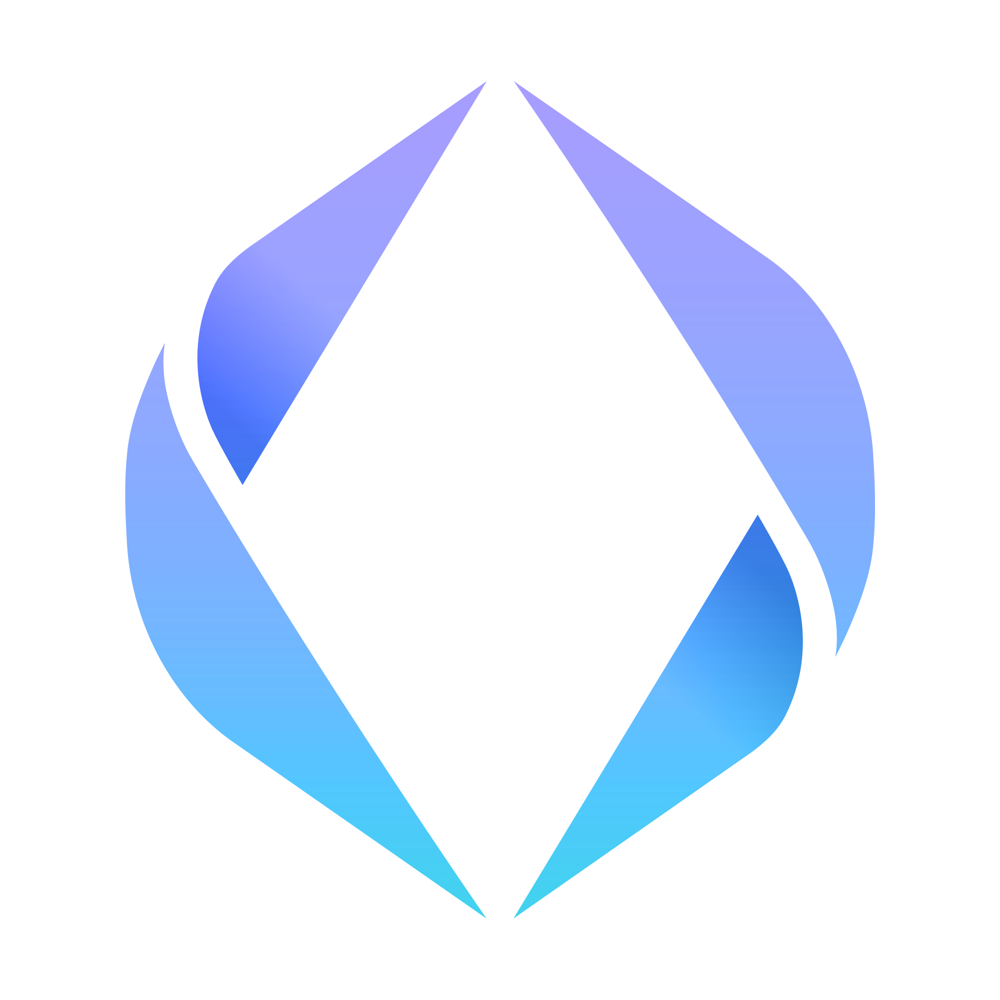

<!-- PROJECT LOGO -->
 

  

  <h3 align="center">Polygon Domain Service (ENS lookalike)</h3>

  

    An awesome website that enables you to save your favorite music/quote/movie/... on the blockchain.
     
    <a href="https://github.com/rom1trt/polygon-name-service-nft"><strong>Explore the docs »</strong></a>
     
     
    <a href="https://github.com/rom1trt/polygon-name-service-nft">View Demo</a>
    ·
    <a href="https://github.com/rom1trt/polygon-name-service-nft/issues">Report Bug</a>
    ·
    <a href="https://github.com/rom1trt/polygon-name-service-nft/issues">Request Feature</a>
  

<!-- TABLE OF CONTENTS -->

  
Table of Contents

  <ol>
    <li>
      <a href="#about-the-project">About The Project</a>
      <ul>
        <li><a href="#built-with">Built With</a></li>
      </ul>
    </li>
    <li>
      <a href="#getting-started">Getting Started</a>
      <ul>
        <li><a href="#installation">Installation</a></li>
        <li><a href="#features">Features</a></li>
      </ul>
    </li>
  </ol>

<!-- ABOUT THE PROJECT -->
## About The Project

A website to mint your own domain as an NFT on the L2 Polygon Network. Your domain will be able to represent your favorite movie, music, quote, or whatever you want.

Mumbai tesnet contract address -> `0xEAA997B319f942FeEb102A0975A6E3420156731A`
You can check the [demo webapp](https://polygon-name-service-nft.vercel.app/) deployed on the testnet  
You can browses minted NFTs on [opensea](https://testnets.opensea.io/collection/rabbit-name-service-v4)

### Built With

* 
* 
* 

<!-- GETTING STARTED -->
## Getting Started

This is an example of how you may give instructions on setting up your project locally.
To get a local copy up and running follow these simple example steps.

### Click on  to launch website

### Installation

1. `git clone https://github.com/rom1trt/polygon-name-service-nft.git` to clone the repository
2. `npm install` to install NPM (Node Package Manager)
3. `cd website`
4. `npm start` to run locally (local host)
5. Browse `https://polygon-name-service-nft.vercel.app/` to access the webapp

### Click on  to launch frontend

### Features

- Mint an ERC721 nft and view it on opensea (https://testnets.opensea.io/collection/rabbit-name-service-v4)
- Bind your favorite movie, email, twitter, music to your domain
- Edit your records by clicking on the pencil of recently minted domains
- Browse domains on the webapp
